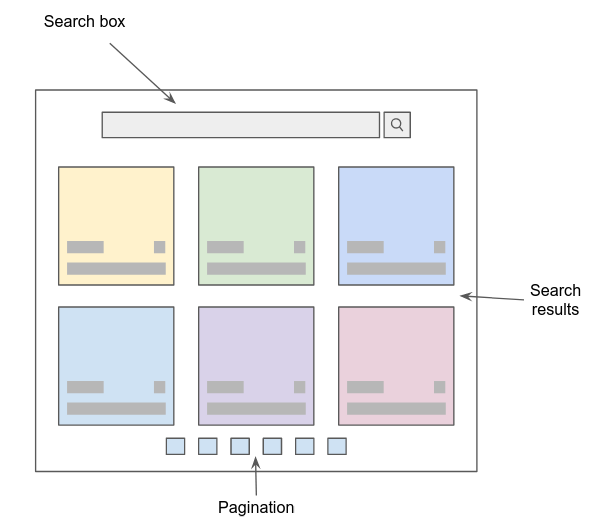

# Movie explorer 🎥
 
You can search for movie title, year or director and the application will mark with a yellow color all the sentences that match with what you type on the search bar

Also you can hover any card to read the description of the movie

# Task requirements

The main requirements are:

- The user should be able to search for movies
- The user should be able to paginate the catalog
- We expect you to use React and TypeScript
- Use a server-side nodejs API that contains the endpoint to retrieve the list of 1000 movies that was available at the following repository (https://github.com/resoptima/frontend-task03). 
